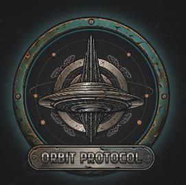

<section id="about">
  

    
    <h1 class="hero-name">Nic Sawaya</h1>
    
Game Developer · FPS Systems · Unreal Engine

    

      I'm a game designer and programmer focused on building systems driven experiences
      with clean mechanics and satisfying loops. My work 
      centers around modular gameplay systems, and building organized, purposeful environments.
    

    <!-- 

      

        2+
        Years Experience
      

      

        3+
        Projects Shipped
      

      

        2
        Engines Used
      

    
 -->
    

      <a href="#projects" class="btn-primary">View Projects</a>
      <a href="#contact" class="btn-secondary">Contact</a>
      <a href="/assets/ResumeV1.pdf" class="btn-secondary" target="_blank">Resume</a>
    

  

</section>

<section id="projects">
  <h2>Projects</h2>
  
A collection of games and prototypes I've built and iterated on.

  

    <button class="filter-btn active" data-filter="game">Games</button>
    <button class="filter-btn" data-filter="prototype">Prototypes</button>
  

  

    <a class="project-card" data-category="game" href="/projects/orbit-protocol">
      
      

        Unreal Engine
        FPS
        Roguelite
        C++
      

      

        <h3>Orbit Protocol</h3>
      

    </a>

    <a class="project-card" data-category="game" href="/projects/velocity-loop">
      
      

        Unreal Engine
        3rd Person
        Platformer
      

      

        <h3>Velocity Loop</h3>
      

    </a>

  

</section>

<section id="apps">
  <h2>Apps</h2>
  
Software and tools I've designed and built.

 

  <a class="project-card" href="/projects/chroma-bench">
    
    

      Color Visualization
      Color Science UI
      NDA‑Compliant
    

    

      <h3>Chroma Bench</h3>
    

  </a>

</section>

<section id="skills">
  <h2>Skills</h2>
  
Tools, technologies, and areas I work in.

  

    

      
    

    

      
    

    

      
    

    

      
    

    

      
    

    

      
    

    

      
    

    

      
    

    

      
    

  

</section>

<section id="contact">
  <h2>Contact</h2>
  
<strong>Email:</strong> your-email-here

  
<strong>GitHub:</strong> <a href="https://github.com/Nic-devv">github.com/Nic-devv</a>

</section>
